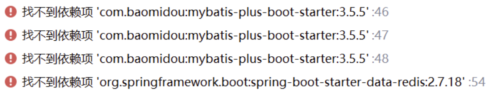
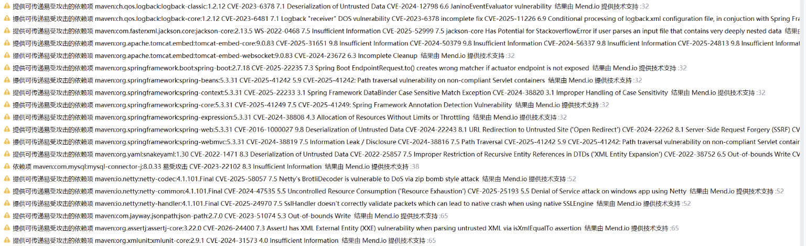
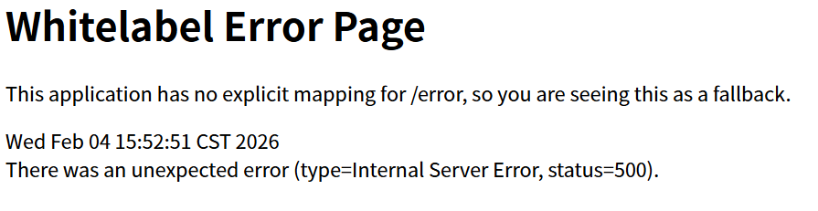
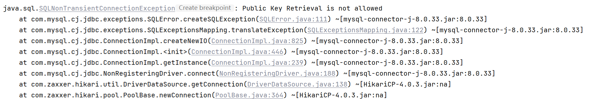
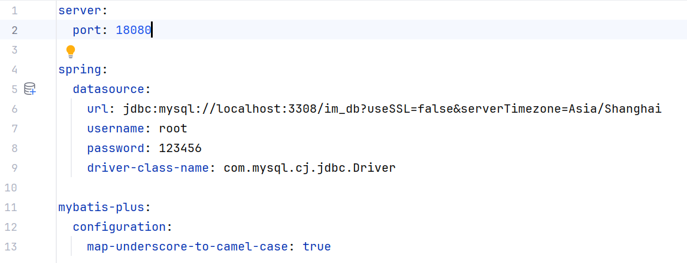

# IMProject

学习一个即时通讯项目


## step 1

在开发版本仅容器化mysql和redis以解决环境问题，Java的容器化考虑在中后期并入，

目前的compose.yaml只使用了mysql和redis相应的镜像，作为开发环境.

同时，持久化保存使用的是bind volume的方式挂载以便于日常开发，后期考虑使用volume的方式进行挂载.


## step 2

---

### Q1

因为SpringBoot对较新的jdk支持不佳，故而将jdk更改为jdk-17（而且是Temurin版本的，下载地址如下：[Latest Releases | Adoptium](https://adoptium.net/zh-CN/temurin/releases?version=17)）。

在用maven配置后端依赖的时候出现下面报错：



一开始以为是没有配置好镜像源，导致无法下载，实际上是mysql的问题

源mysql配置，缺少版本指定（version标签）：

```xml
<dependency>
    <groupId>mysql</groupId>
    <artifactId>mysql-connector-java</artifactId>
    <scope>runtime</scope>
</dependency>
```

在SpringBoot 2.7.18的依赖管理中移除了对mysql-connector-java的版本管理，只保留了新版mysql-connector-j的版本管理，因此maven解析失败，进而导致整个依赖树，后续正确配置的依赖项也失败。

因此，有两种方式，一种是添加版本指定，另一种就是采用新的mysql-connector-j，后者可以利用SpringBoot的版本依赖，实现版本自动管理，因此采用新的mysql-connector-j，如下所示：

```xml
<dependency>
    <groupId>com.mysql</groupId>
    <artifactId>mysql-connector-j</artifactId>
    <scope>runtime</scope>
</dependency>
```

使用如下命令，清理临时文件和目录，重置构建状态即可：

```bash
mvn clean
```

当然，这里使用的是与IDEA绑定的maven，因此，直接在IDEA侧边栏点击maven，点开项目，在生存期下找到clean，双击即可达到同样的效果。

想要查看是否是与IDEA绑定的maven，可以在设置中查看构建工具栏目下的maven设置，看一看maven主路径是否是已捆绑，如果是则是使用的与IDEA绑定的maven。

> 注意：
> 
> 这里暂时使用的是SpringBoot 2.x版本，上面处理完后大概会出现很多警告，如下：
> 
> 
> 
> 这些都是已知漏洞，可以考虑更新SpringBoot，使用较新的SpringBoot来避免漏洞和生产实际的黑客攻击。

---

### Q2

在写好最小可启动代码后运行，访问网页出现下面问题：



回去看代码，发现有下面报错：



很明显：Public Key Retrieval is not allowed。这是mysql的问题，密码不允许明文传输，我在application.xml里面有如下配置：




可以看到密码都是指定的，目前阶段，先添加在url中更改为下面字段允许明文密码：

```xml
url: jdbc:mysql://localhost:3308/im_db?useSSL=false&serverTimezone=Asia/Shanghai&allowPublicKeyRetrieval=true
```

> tips-1：
> 
> SpringBoot的启动代码要放在上级目录下。
> 
> 例如：org.example.backend.entity这样的编排,则需要将启动的主程序放置在org.example.backend目录下.

> tips-2:
> 
> 指定SpringBoot的启动端口,需要在application.xml中写:
> 
> ```xml
> server:
>   port: xxxx
> ```

> tips-3:
> 
> 在运行启动应用的代码前记得在mysql中执行创建表的工作
> 
> 启动流程如下(在IMProject目录下):
> 
> ```bash
> docker compose up -d
> 
> docker exec -it im-mysql mysql -u root -p
> ```
> 
> 然后输入密码123456
> 
> 使用下面mysql指令后运行BackendApplication,浏览器中访问http://localhost:18080/users即可
> 
> ```sql
> > USE im_db;
> 
> > CREATE TABLE user (
> >    id BIGINT PRIMARY KEY AUTO_INCREMENT,
> >    username VARCHAR(50) NOT NULL,
> >    password VARCHAR(100) NOT NULL,
> >    create_time DATETIME DEFAULT CURRENT_TIMESTAMP
> >);
> 
> 
> ```


## Step 3

### 完成了两个简单功能和工程化规范：

#### 1.创建用户

POST http://localhost:18080/users

请求体：

```json
{
    "username": "Alice",
    "password": "12345678"
}
```

响应：

```json
{
    "code": 200,
    "message": "success",
    "data": 1
}
```

#### 2.根据id搜索用户

GET http://localhost:18080/users/{id}

响应：

```json
{
    "code": 200,
    "message": "success",
    "data": {
        "username": "Alice",
        "createTime": ""2026-02-04T21:51:45""
    }
}
```

> 使用Apifox，进行接口测试

#### 3.使用统一的返回格式，定义Result类

#### 4.定义BusinessException，并用GlobalExceptionHandler统一处理异常

#### 5.Controller默认success，Service针对异常情况抛出对应异常

#### 6.添加参数校验，在用户创建的时候，用户名和密码不能为空，且有长度要求

#### 7.使用DTO机制，而不是直接将实体作为传输数据


